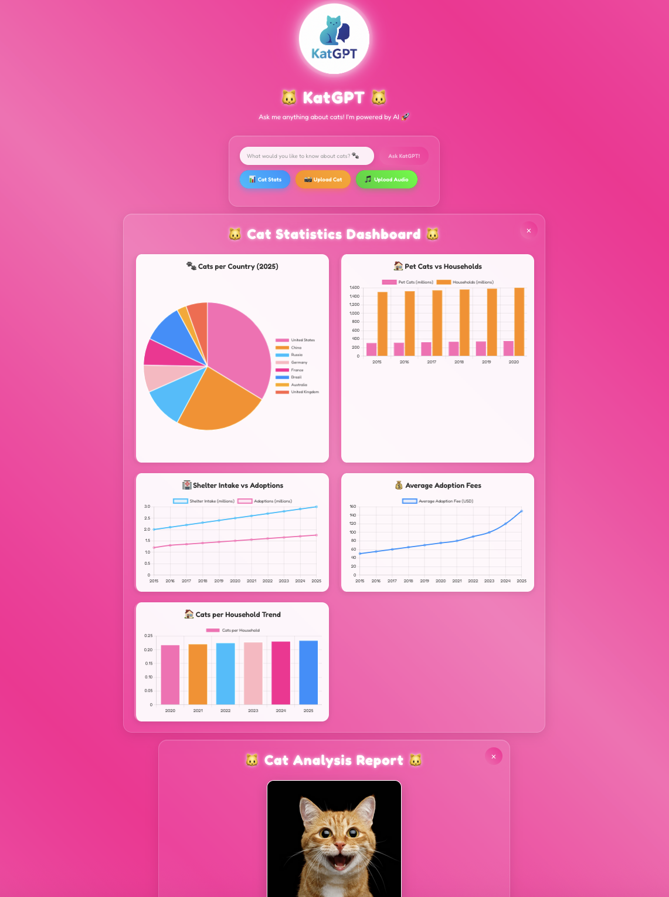

# 🐱 KatGPT - Cat Q&A AI Application

A flashy, pink-themed FastAPI backend with React frontend that allows users to ask questions about cats using OpenAI's GPT-4o model. Features stunning visual effects, animations, and a modern UI.

## 📸 Screenshot



## ✨ Features

- **🎨 Flashy Pink Design**: Beautiful gradient backgrounds with animated effects
- **🚀 FastAPI Backend**: High-performance API with OpenAI GPT-4o integration
- **⚛️ React Frontend**: Modern, responsive UI with smooth animations
- **🎭 Visual Effects**: Floating particles, sparkles, and glowing animations
- **📊 Cat Statistics Dashboard**: Interactive charts with cat data visualizations
- **📸 AI Cat Image Analysis**: Upload cat photos for mood, health, and care analysis
- **🎵 AI Cat Audio Analysis**: Upload cat sounds for mood, health, and care analysis
- **📱 Responsive**: Works perfectly on desktop and mobile devices
- **🔒 CORS Enabled**: Properly configured for development and production

## 🛠️ Tech Stack

### Backend
- **FastAPI** - Modern Python web framework
- **OpenAI GPT-4o** - AI model for cat-related questions
- **OpenAI GPT-4o Vision** - AI model for cat image analysis
- **OpenAI Whisper** - AI model for cat audio transcription and analysis
- **Uvicorn** - ASGI server
- **Pydantic** - Data validation

### Frontend
- **React 18** - Frontend framework
- **Styled Components** - CSS-in-JS styling
- **Framer Motion** - Animation library
- **Axios** - HTTP client
- **Chart.js** - Interactive charts and graphs
- **React Chart.js 2** - React wrapper for Chart.js
- **Papa Parse** - CSV parsing library

## 🚀 Quick Start

### Prerequisites
- Python 3.8+
- Node.js 16+
- OpenAI API Key

### 1. Clone and Setup
```bash
cd AI-demo-app
```

### 2. Backend Setup
```bash
# Install Python dependencies (in virtual environment)
source demo-venv/bin/activate
pip install -r requirements-minimal.txt

# Create .env file with your API key
cp env.example .env
# Edit .env file and add your OpenAI API key

# Start the backend
./start_backend.sh
```

The backend will be available at `http://localhost:8000`

### 3. Frontend Setup
```bash
# Install Node.js dependencies
cd frontend
npm install

# Start the frontend (from project root)
cd ..
./start_frontend.sh
```

The frontend will be available at `http://localhost:3000`

## 📁 Project Structure

```
AI-demo-app/
├── backend/
│   └── main.py              # FastAPI application
├── frontend/
│   ├── public/
│   │   ├── index.html       # HTML template with effects
│   │   ├── logo.png         # KatGPT logo
│   │   └── manifest.json    # PWA manifest
│   ├── src/
│   │   ├── App.js           # Main React component
│   │   ├── App.css          # Additional styles
│   │   ├── index.js         # React entry point
│   │   └── index.css        # Base styles
│   └── package.json         # Frontend dependencies
├── KatGPT_logo.png          # Original logo
├── requirements.txt         # Python dependencies
├── env.example             # Environment variables template
├── start_backend.sh        # Backend startup script
├── start_frontend.sh       # Frontend startup script
└── README.md               # This file
```

## 🎨 Design Features

### Visual Effects
- **Gradient Background**: Animated pink gradient that shifts colors
- **Floating Particles**: 50+ animated particles floating across the screen
- **Sparkle Effects**: Random sparkles appearing throughout the UI
- **Glowing Logo**: Pulsing glow effect around the KatGPT logo
- **Glass Morphism**: Frosted glass effect on the chat container

### Animations
- **Logo Animation**: Rotating entrance with scale effect
- **Title Glow**: Pulsing glow animation on the main title
- **Button Hover**: Scale and shadow effects on interactions
- **Loading Animation**: Animated dots during AI processing
- **Smooth Transitions**: Framer Motion powered smooth animations

### Responsive Design
- **Mobile Optimized**: Fully responsive design for all screen sizes
- **Touch Friendly**: Large touch targets for mobile devices
- **Flexible Layout**: Adapts to different screen orientations

## 🔧 API Endpoints

### Backend API (FastAPI)

#### `GET /`
- **Description**: Health check endpoint
- **Response**: Welcome message

#### `GET /health`
- **Description**: Service health status
- **Response**: `{"status": "healthy", "service": "KatGPT API"}`

#### `POST /ask`
- **Description**: Ask a question about cats
- **Request Body**:
  ```json
  {
    "question": "Why do cats purr?"
  }
  ```
- **Response**:
  ```json
  {
    "answer": "Cats purr for various reasons...",
    "success": true
  }
  ```

#### `GET /cat-stats`
- **Description**: Get cat statistics data for charts
- **Response**:
  ```json
  {
    "global_stats": [
      {
        "Year": "2025",
        "Estimated_Global_Cats": 800000000,
        "Estimated_Pet_Cats": 400000000,
        "Number_of_Households": 1700000000,
        "Cats_per_Household": 0.235,
        "Cats_in_Shelters_Intake": 3000000,
        "Cats_Adopted_From_Shelters": 1750000,
        "Adoption_Fee_USD": 150
      }
    ],
    "country_stats": [
      {
        "Country": "United States",
        "Estimated_Cats_millions": 74.1
      }
    ],
    "success": true
  }
  ```

#### `POST /analyze-cat-image`
- **Description**: Analyze a cat image and provide insights
- **Request**: Multipart form data with image file
- **Response**:
  ```json
  {
    "mood": "The cat appears happy and relaxed! 😸",
    "health_observations": "Bright eyes, clean fur, alert posture",
    "recommendations": "Continue providing love and enrichment activities",
    "care_steps": "1. Maintain regular feeding schedule\n2. Provide interactive toys\n3. Ensure clean litter box",
    "success": true
  }
  ```

#### `POST /analyze-cat-audio`
- **Description**: Analyze a cat audio file and provide insights
- **Request**: Multipart form data with audio file (m4a, mp3, wav, ogg)
- **Response**:
  ```json
  {
    "sound_description": "A soft, melodic meow with purring undertones 🎵",
    "mood_analysis": "The cat sounds content and seeking attention! 😸",
    "health_concerns": "No immediate health concerns detected",
    "recommendations": "Respond to your cat's communication with affection",
    "care_steps": "1. Spend quality time with your cat\n2. Provide interactive play\n3. Ensure comfortable environment",
    "success": true
  }
  ```

## 🎯 Usage Examples

### Sample Questions
- "Why do cats purr?"
- "What's the best food for kittens?"
- "How can I train my cat to use a litter box?"
- "What are the signs that my cat is happy?"
- "How long do cats typically live?"

### Sample Audio Files
Upload any of these cat sound types:
- **Meows** - Different pitches and lengths for various moods
- **Purrs** - Content, healing, or comfort-seeking sounds
- **Chirps** - Excited or hunting behavior sounds
- **Hisses** - Warning or defensive vocalizations
- **Yowls** - Mating calls or distress signals

### Cat Statistics Dashboard
Click the **📊 Cat Stats** button to view interactive charts showing:
- **🐾 Cats per Country**: Pie chart showing cat populations by country
- **🏠 Pet Cats vs Households**: Stacked bar chart comparing cat ownership trends
- **🏥 Shelter Intake vs Adoptions**: Line chart showing shelter statistics over time
- **💰 Average Adoption Fees**: Line chart showing adoption fee trends
- **🏠 Cats per Household Trend**: Bar chart showing household cat density

### AI Cat Image Analysis
Click the **📸 Upload Cat** button to analyze cat photos:
- **😸 Mood Analysis**: AI determines how your cat is feeling
- **🏥 Health Observations**: Physical condition and behavioral insights
- **💡 Recommendations**: Suggestions to improve your cat's wellbeing
- **📋 Care Steps**: Specific actionable steps for better cat care
- **🎉 Confetti Celebration**: Fun animation when analysis completes!

### AI Cat Audio Analysis
Click the **🎵 Upload Audio** button to analyze cat sounds:
- **🎵 Sound Description**: AI identifies the type and characteristics of cat vocalizations
- **😸 Mood Analysis**: Determines how your cat is feeling based on sound
- **🏥 Health Concerns**: Identifies potential health issues from vocal patterns
- **💡 Recommendations**: Suggestions to address the cat's needs
- **📋 Care Steps**: Specific actionable steps for better cat care
- **🎉 Confetti Celebration**: Fun animation when analysis completes!

### API Usage
```javascript
// Example API call
const response = await fetch('http://localhost:8000/ask', {
  method: 'POST',
  headers: {
    'Content-Type': 'application/json',
  },
  body: JSON.stringify({
    question: 'Why do cats purr?'
  })
});

const data = await response.json();
console.log(data.answer);
```

## 🔒 Environment Variables

The application automatically loads environment variables from a `.env` file. 

**Quick Setup:**
```bash
# Copy the template
cp env.example .env

# Edit .env file and add your OpenAI API key
nano .env  # or use your preferred editor
```

**Required Variables:**
- `OPENAI_API_KEY` - Your OpenAI API key (required)
- `BACKEND_HOST` - Backend host (default: 0.0.0.0)
- `BACKEND_PORT` - Backend port (default: 8000)
- `REACT_APP_API_URL` - Frontend API URL (default: http://localhost:8000)

## 🚀 Deployment

### Backend Deployment
1. Set environment variables
2. Install dependencies: `pip install -r requirements.txt`
3. Run with production server: `uvicorn backend.main:app --host 0.0.0.0 --port 8000`

### Frontend Deployment
1. Build the app: `cd frontend && npm run build`
2. Serve the `build` folder with any static file server
3. Update API URL in environment variables for production

## 🐛 Troubleshooting

### Common Issues

1. **Backend won't start**
   - Check if OpenAI API key is set
   - Ensure all dependencies are installed
   - Verify port 8000 is available

2. **Frontend can't connect to backend**
   - Ensure backend is running on port 8000
   - Check CORS configuration
   - Verify proxy settings in package.json

3. **Logo not displaying**
   - Ensure logo.png exists in frontend/public/
   - Check file permissions

4. **Python Dependencies Installation Issues**
   - **Pydantic compilation errors**: Try `pip install --upgrade pip setuptools wheel`
   - **Python 3.13 compatibility**: Use `pip install -r requirements-minimal.txt`
   - **Rust compilation errors**: Install Rust or use pre-compiled wheels
   - **Alternative**: Create a virtual environment with Python 3.11 or 3.12

### Quick Fix for Dependency Issues

```bash
# Option 1: Upgrade pip and try again
pip install --upgrade pip setuptools wheel
pip install -r requirements.txt

# Option 2: Use minimal requirements
pip install -r requirements-minimal.txt

# Option 3: Create new virtual environment with older Python
python3.11 -m venv venv
source venv/bin/activate
pip install -r requirements.txt
```

## 🤝 Contributing

1. Fork the repository
2. Create a feature branch
3. Make your changes
4. Test thoroughly
5. Submit a pull request

## 📄 License

This project is open source and available under the [MIT License](LICENSE).

## 🎉 Complete Feature Summary

Your KatGPT application now includes **four powerful AI-powered features**:

### 🚀 **Core Features**
1. **💬 Ask Questions** - Chat with AI about cats using GPT-4o
2. **📊 Cat Statistics Dashboard** - Interactive charts with cat data visualizations
3. **📸 AI Cat Image Analysis** - Upload cat photos for mood, health, and care analysis using GPT-4o Vision
4. **🎵 AI Cat Audio Analysis** - Upload cat sounds for mood, health, and care analysis using OpenAI Whisper + GPT-4o

### 🎨 **Visual Features**
- **Flashy Pink Theme** with gradient backgrounds and glowing effects
- **Animated Logo** with rotation and scaling effects
- **Video Background** with particle effects and sparkles
- **Confetti Animations** when analysis completes
- **Glass Morphism UI** with backdrop blur effects
- **Responsive Design** that works on all devices

### 🤖 **AI Capabilities**
- **Text Analysis**: GPT-4o for cat-related questions and advice
- **Image Analysis**: GPT-4o Vision for cat photo interpretation
- **Audio Analysis**: OpenAI Whisper for sound transcription + GPT-4o for analysis
- **Comprehensive Insights**: Mood, health, recommendations, and care steps

### 🛠️ **Technical Stack**
- **Backend**: FastAPI with OpenAI API integration
- **Frontend**: React with Styled Components and Framer Motion
- **Data Visualization**: Chart.js with interactive charts
- **File Handling**: Multipart uploads for images and audio
- **Real-time Processing**: Live analysis with loading states

## 🙏 Acknowledgments

- OpenAI for the amazing GPT-4o, GPT-4o Vision, and Whisper models
- FastAPI team for the excellent framework
- React team for the powerful frontend library
- Framer Motion for smooth animations
- Chart.js for beautiful data visualizations

---

**Made with ❤️ and lots of 🐱 for cat lovers everywhere!**
